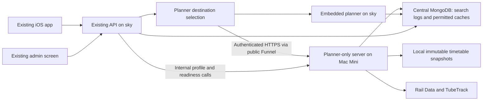

# Separate journey planner server: implementation plan

Date: 20 September 2026; decisions updated 21 September 2026  
Repository reviewed: `00a4b11`  
Status: **Planner implementation remains on hold. Architecture decisions agreed below. Automatic power restart was separately authorized, but the change requires an administrator password and has not been applied.**

## 1. Proposed approach

Keep the existing TrainTrack API as the app-facing gateway. Run the complete planner HTTP service in a separate Node process on the Mac Mini, and let the gateway select the planner destination. Continue storing search history centrally, with the executing host recorded on every new search row.

Use the existing planner modules and lockfile from this repository. Add a production entry point rather than copying the planner into another repository or running a second copy of the entire API. Preserve an embedded mode on the current API host for development and controlled rollback.

The app continues using its existing URLs, request formats, job polling, pagination, and journey IDs. A host change happens entirely behind the API.



The diagram shows the agreed restricted private MongoDB access. Public Funnel is used for API-to-planner HTTPS only; the database connection remains separate and private.

## 2. Agreed decisions and remaining operational checks

On 21 September, Mike accepted the recommended decisions, except that API-to-Mini requests will use the existing public Funnel URL for now. This approves the plan's direction, not planner implementation or deployment. Mike separately authorized enabling automatic restart after power failure.

| Decision | Agreed approach | Implementation consequence |
| --- | --- | --- |
| Switching destination | Admin selection from configured targets, taking effect without restarting the API | Implement persisted target selection and existing admin protection |
| Mini outage | Manual switch back initially | Keep a tested rollback target; automatic fallback is outside initial scope |
| API-to-Mini network | Existing public Funnel URL with service authentication | Use a separate authenticated mount on `https://mikes-mac-mini.dog-rattlesnake.ts.net/`; no API-to-planner tailnet membership prerequisite |
| Central persistence | Restricted access to required MongoDB collections over a private connection | Verify a separate private database path; do not expose MongoDB through Funnel |
| Mini startup | System service that can run without an interactive login | Use a system LaunchDaemon and arrange boot-time network/service dependencies; FileVault recovery remains a separate question |
| Searches during host changes | Preserve ownership of existing jobs, details, and cursors while the old host drains | Implement the bounded routing-ownership store |
| Timing-history delivery | Preserve existing bounded, best-effort logging | Durable on-disk delivery is outside initial scope |
| Power recovery | Enable automatic restart after power failure | Authorized; attempted on 21 September but blocked by the Mini's administrator-password requirement |

One remaining user decision:

- **FileVault recovery:** FileVault is confirmed enabled. Is an operator unlocking the disk after a power failure acceptable, or is fully unattended recovery required? Keep FileVault enabled while this is unresolved. Apple documents SSH unlock after restart on Apple silicon with macOS 26 or later when Remote Login and networking are available; verify the Mini's actual recovery path and do not assume its local Funnel/Tailscale service is reachable before unlock. See [Apple's FileVault management guidance](https://support.apple.com/en-ca/guide/security/sec8447f5049/web).

Operational checks for implementation, rather than further architecture choices:

- Establish the private Mini-to-Mongo route. Public planner HTTPS does not solve database reachability. Tailscale or another private connection may still be needed for this separate dependency.
- Verify service account, final port, credential provisioning, authoritative local Funnel configuration, and boot-time Funnel operation. Existing Funnel configuration is currently reapplied by a user LaunchAgent.
- Recheck deployed versions and effective admin authentication before activation.

### Power-restart action status

On 21 September, `sudo -n pmset -a autorestart 1` was attempted over `ssh mini`. It returned `sudo: a password is required`; a subsequent `pmset -g custom` still reported `autorestart 0`. No power setting was changed and no reboot or power-loss test was performed.

To complete the authorized action, run the following interactively on the Mini and enter its administrator password there:

```sh
sudo /usr/bin/pmset -a autorestart 1
/usr/bin/pmset -g custom
```

Verify `autorestart 1` in the AC Power section. Enabling this setting does not resolve FileVault unlock or boot-time service availability by itself.

## 3. Findings from the current code and hosts

### 3.1 Existing application boundaries

Paths below are relative to the repository root.

| Area | Current implementation | Consequence for the split |
| --- | --- | --- |
| Public planner routes | `api/train-track-api/lib/planner-routes.js` | Includes v3 search, jobs, details, stations/status, v3 route boards, and v4 route boards; all belong in routing scope |
| Planner process | `lib/planner/service.js`, `worker.js` | Owns routing workers, queues, worker affinity, upstream broker, and in-memory journey details |
| Development server | `scripts/planner.js`, `serve` command | Already starts planner routes on loopback; lacks the complete production lifecycle and service boundary |
| API bootstrap | `api/train-track-api/index.js` | Creates the planner, passes it to admin and disruption monitoring, and starts ingestion alongside other API services |
| Queued searches | `lib/planner/search-jobs.js` | Jobs, leases, coalescing, and idempotency are process-local; polling is not the search duration |
| Saved routes | `lib/planner/route-boards.js`, `saved-route-boards.js`, `saved-route-live.js` | Own background jobs, live refreshes, local caches, and shared Mongo caches |
| Search history | `lib/planner-search-log.js` | Asynchronous, bounded Mongo writer; seven-day retention; detailed phase/CPU/memory measurements; no host field |
| Admin history | `lib/planner-search-admin.js`, `admin-portal.js` | Reads central history and directly calls the local planner to clear search caches |
| Mongo indexes | `lib/mongo-client.js` | Creates planner indexes as part of a broader API index initializer |
| Timetable updates | `lib/planner/ingestion-scheduler.js`, `ingestion-source.js` | Starts a child CLI process; persists local state, snapshots, and absolute-path activation pointers |
| Disruption monitoring | `lib/disruptions/manager.js`, `policy.js` | Calls planner methods and reads local `ingestion-state.json`; this dependency must become remote-aware |
| Runtime metrics | `lib/metrics.js`, `lib/planner/ingestion-metrics.js` | Timetable gauges currently read the local data directory |
| iOS URLs | `ios/TrainTrack UK/TrainTrack UK/JourneyPlannerClient.swift` | Derives v3/v4 endpoints from the existing selected API host; no destination discovery is needed in the app |

Important details:

- The inspected worker configuration supports **one or two routing workers**, not an arbitrary CPU-count setting. Defaults are two workers and a 1,024 MiB V8 old-generation limit per routing worker. This is not a process RAM limit.
- The normal synchronous search allowance defaults to 30 seconds. Queued work defaults to 10 minutes processing and 8 minutes admission waiting. HTTP submission/polling must stay short.
- Queued-search leases expire after 2 minutes without refresh; terminal results normally remain for 10 minutes. Journey details are bounded in memory and expire after up to 1 hour. Live/TfL cursors depend on their original worker snapshots, which can expire sooner.
- `registerPlannerRoutes()` defaults to the Mongo-backed search logger. The development `serve` command does not explicitly disable logging; do not assume it has no database activity simply because it avoids full API startup.
- V3 profiles use `planner_route_profiles_v1`; v4 plans use `planner_saved_route_plans_v1`. The v4 live provider calls `getTrainTimes()`, which also writes public observations to `recent_departures`.
- Provider throttling and request coalescing are process-local. After separation, API and planner upstream traffic still share provider account limits.

### 3.2 Read-only host observations

Observed through `ssh mini` on 20 September, with power/FileVault checks updated on 21 September:

| Item | Observed value |
| --- | --- |
| Platform | macOS 26.6.2, arm64 |
| Memory / logical CPUs | 16 GiB / 8 |
| Available disk space | Approximately 323 GiB on the home volume |
| Node | Homebrew executable reports v26.9.0; not found in the default non-interactive SSH PATH |
| Tailscale | App CLI reports 1.102.2; not found in the default SSH PATH |
| ZIP support | `/usr/bin/unzip` present |
| AC sleep | `sleep 0` |
| Automatic power restart | `autorestart 0`; authorized change blocked by password requirement on 21 September |
| FileVault | On, verified 21 September |
| Existing supervision | Several user LaunchAgents, including a Funnel configuration reapply agent |

The supplied HTTPS address is **currently Funnel-enabled**. Its configured routes include `/train-track` to port 3012 and `/bromley-bins` to 3013, plus Grafana, healthcheck, and other applications. These are configured reservations; the listener check did not establish that every mapped service is currently running.

Do not replace the root mapping, reuse 3012/3013, or assume an added path on the current Funnel listener is private. Provisionally reserve **3014**, subject to a fresh port/configuration check at deployment.

`com.mike.tailscale-funnel-apply.plist` invokes `/Users/mwagstaff/bin/tailscale-funnel-apply.sh`. The authoritative configuration behind that script must be located and updated through its local source so a reboot does not undo the planner mapping.

The existing deployment definition is in `/Users/mwagstaff/dev/server-tooling/deploy/config/node_projects.json`. The TrainTrack entry points to the API source and pins a **Linux-specific** Node path on `sky`. It cannot simply be reused unchanged for the Mini. The deployer supports macOS user launchd domains and Linux systemd; a system LaunchDaemon would require an explicit tooling addition or a separate reviewed service template.

## 4. Service boundary and code organization

### 4.1 Add a planner-only production entry point

Proposed entry point: `api/train-track-api/planner-server.js`, started by a new `start:planner` package script.

It should initialize only:

1. Validated service configuration, host identity, and internal authentication.
2. Planner service, route-board managers, and search-job manager.
3. Planner routes and the small internal operations API.
4. Search logging and the permitted persistence dependencies.
5. Timetable ingestion for this host, when explicitly enabled.
6. Health/readiness and planner/runtime metrics.
7. Bounded shutdown of HTTP, background work, workers, ingestion, logging, and database connections.

It must not import the full `index.js`, start notification/live-activity loops, instantiate APNs clients, or run the device disruption scheduler. The existing API keeps all of those responsibilities.

Keep shared source in the existing package initially. A second repository/package, containers, distributed worker queue, and routing-algorithm changes are outside this extraction. Independent **deployment and process lifecycle** satisfy the separate-server objective.

Factor route construction just enough that the same router can be mounted as the embedded destination or inside the standalone process. Preserve existing service injection used by tests.

### 4.2 Public endpoint coverage

Forward these exact operations through the gateway:

| Namespace | Method and path |
| --- | --- |
| `/api/v3/journey-planner` | `GET /status` |
| Same | `GET /stations?q=...` |
| Same | `POST /search` |
| Same | `POST /search-jobs` |
| Same | `GET /search-jobs/:id` |
| Same | `DELETE /search-jobs/:id` |
| Same | `GET /journeys/:id` |
| Same | `POST /route-boards` |
| `/api/v4/journey-planner` | `POST /route-boards` |

Leave legacy endpoints on the API. The public reverse-proxy prefix, such as `/train-track`, remains intact. Do not redirect the device to the Mini or publish planner credentials/addresses in app configuration.

### 4.3 Internal operations

Add a small authenticated internal namespace on the planner server, excluded from public gateway forwarding:

| Proposed operation | Purpose |
| --- | --- |
| `GET /internal/planner/v1/health` | Process identity, protocol/build version, host ID, readiness summary |
| `GET /internal/planner/v1/readiness` | Matched dataset/ingestion summary and advisory capacity for background checks |
| `POST /internal/planner/v1/disruption-profile` | Bounded, maintenance-priority profile computation |
| `POST /internal/planner/v1/cache/clear` | Existing search-cache clearing semantics on the selected destination |
| Private metrics endpoint | Planner runtime, request, provider, and ingestion metrics |

Do not expose arbitrary `service.call(method)` RPC, filesystem paths, SQL, raw timetable downloads, ingestion activation, or shell commands.

Provide a narrow local/remote facade for admin and disruption monitoring. Do not try to emulate the entire worker service API over HTTP: job and board managers already use worker-level calls, callbacks, and scheduling state and should remain together on the execution host.

## 5. Backend routing and configuration

### 5.1 Configured target registry

Add a backend-only registry with stable target IDs, for example `sky` and `mini`. Each target defines embedded/remote mode, display label, base URL if remote, expected execution host identity, credential reference, and supported internal protocol version.

Keep URLs and credentials in deployment configuration. Let the admin choose a **registered target ID**, not enter an arbitrary URL. Validate scheme, origin, base path, and credentials at startup; disable redirect following to avoid sending secrets to a different origin.

Proposed settings, all new unless marked existing:

| Setting | Owner | Purpose |
| --- | --- | --- |
| `PLANNER_TARGETS_FILE` | API | Absolute path to target definitions outside synced source; secrets referenced separately |
| `PLANNER_DEFAULT_TARGET` | API | Initial target when no persisted selection exists; initially `sky` |
| `PLANNER_FORCE_TARGET` | API | Explicit operational override; admin UI displays that selection is locked |
| `PLANNER_HOST_ID` | Each execution host | Stable identity, e.g. `sky` or `mikes-mac-mini`, independent of URL or process restart |
| `PLANNER_LISTEN_HOST` | Standalone planner | Loopback behind Serve/Funnel; otherwise a specifically approved private interface |
| `PORT` | Standalone planner | Provisionally 3014 |
| `PLANNER_SERVICE_TOKEN` | API + planner | Per-target service credential, managed outside source control |
| `MONGODB_URI_TRAIN_TRACK_UK` (existing) | Planner | Restricted private database credentials; no default-localhost production fallback |
| `PLANNER_DATA_DIR` (existing) | Execution host | Absolute persistent local storage |
| `PLANNER_INGESTION_ENABLED` (existing) | Execution host | Explicit role configuration, not accidental activation from inherited secrets |
| Existing `PLANNER_*` tuning | Execution host | Retain search limits and worker configuration |

Start with existing limits. Tune the Mini only after representative measurements. Its eight CPUs do not make `PLANNER_WORKERS=8` a supported configuration.

### 5.2 Admin destination selection

Implement the agreed dynamic selection:

- Persist one versioned configuration document in central MongoDB, containing active target ID, revision, update time, and authenticated operator identity if available.
- Read it through a short bounded cache. Pin a target and configuration revision for each request/work admission; do not change destination halfway through a request.
- Show the current target, readiness, build/dataset information, and last successful health check in the existing planner admin page.
- Validate the candidate's authentication, identity, protocol, and planner readiness before activation. Failure leaves the previous selection unchanged.
- Use a revision comparison for updates so two admin tabs cannot silently overwrite each other. Record the change and previous target for rollback.
- Protect the mutation with verified existing admin authentication/perimeter protection plus same-origin CSRF checks. Current cache-clear CSRF checks alone are not operator authentication; inspect the deployed admin boundary before adding this control.
- On database failure, retain the last known selection and show stale configuration status. A cold startup without a valid selection fails planner routing explicitly; it must not silently select another host.
- Keep general API startup and legacy routes available when only the remote planner is unavailable.

Environment-only configuration is an alternative for a future scope change, not the agreed implementation. Keep the explicit operational override alongside the admin selection.

### 5.3 HTTP behavior and caller identity

- Preserve request bodies, query parameters, status codes, planner error envelopes, `Retry-After`, and `Cache-Control: no-store`. Never replace a planner error with a proxy HTML page.
- Preserve the 16 KiB planner body limit before the API's 1 MiB legacy JSON parser. Cover malformed JSON, wrong content type/encoding, and oversized bodies at both boundaries. Bound response size using measured station-list and board payloads rather than applying the request limit to responses.
- Forward `X-Planner-Client` and `Idempotency-Key`. Derive the caller network at the trusted public boundary, then send it in an authenticated internal header.
- Strip incoming internal-authentication, host-identity, and internal-forwarding headers before setting trusted values. Do not make all remote callers look like the API host, and do not broadly trust arbitrary `X-Forwarded-For` or `CF-Connecting-IP` headers.
- Authenticate before running planner work or trusting internal caller metadata, even behind private Tailscale.
- Use bounded connect/request deadlines and propagate cancellation on synchronous searches. Poll disconnection does not cancel a queued job; explicit `DELETE` and existing lease expiry retain that role.
- Initial HTTP budgets: roughly 3 seconds to connect, 10 seconds for metadata/job control/boards, and the existing synchronous execution allowance plus a small transport margin for `/search`. Validate these against the app's 15-second board and 30-second request limits and actual reverse proxies. Do not hold job submission open for the 10-minute processing allowance.
- No automatic POST retries at the gateway. A submission timeout can mean the job was accepted; retries must reuse its idempotency key and original destination.
- On remote transport failure, return existing compatible unavailable/timeout errors. Preserve `/status` semantics: planner unavailability is normally HTTP 200 with `available: false`.
- HTTP request metrics stay at the gateway; execution lifecycle logs stay at the planner. A poll response is not a completed search.

## 6. Host switching, state ownership, and rollback behavior

The current planner is stateful. Two hosts with identical SQLite snapshots do **not** share running jobs, journey details, or live pagination snapshots. Random per-request load balancing is unsuitable.

### 6.1 Agreed continuity behavior

Add a bounded, expiring routing-ownership store in central MongoDB, with a small in-memory cache. This stores routing metadata, not search results or raw user searches.

- Pin `(caller, Idempotency-Key)` to the selected target **before forwarding** a submission. Use an HMAC of the caller/key and request fingerprint, with an API-owned secret; retain conflict detection for key reuse with a different request.
- Record returned job IDs and the returned journey IDs/cursor digests against the responding target before releasing a successful response to the caller. Extract artifacts from synchronous results, completed jobs, and both route-board response formats.
- Route job polling/cancellation to the job owner. Route journey details and cursor continuation to a known issuing host. Preserve all public token formats; the app need not decode a new envelope.
- A host switch affects fresh admissions. Existing ownership records continue pointing to the old target while it drains. Old and new hosts can write host-labelled logs concurrently.
- If identical journey IDs or stateless cursors occur on both hosts, retain a bounded set of confirmed issuers rather than blindly overwriting ownership. Prefer the existing issuer; only try another confirmed issuer for a safe read when appropriate. Never probe arbitrary hosts with a POST or a live snapshot cursor.
- For pre-migration artifacts, temporarily use the original embedded host as a legacy owner during rollout. Missing/expired state must return the existing expiry error, not fabricate results or replay a job elsewhere.
- Retain entries for the corresponding server lifetimes, refresh active job ownership on successful polling, and enforce hard count/age caps. Normal non-live cursors have dataset-retention semantics rather than a universal one-hour TTL: define a bounded drain period and explicitly expire older continuations when retiring a host.
- Routing records surviving an API restart preserve access to a still-running remote job. They do not resurrect state lost when the planner itself restarts.
- Treat ownership persistence as part of admission/response correctness, unlike best-effort timing logs. If it cannot be saved, fail that new admission/response safely. Keep the idempotency binding available for recovery after an accepted-but-unacknowledged submission.

This is the main extra complexity in seamless switching. Test it before claiming uninterrupted host changes.

### 6.2 Unselected alternative: immediate switching

An immediate switch without the ownership store would make some in-progress jobs/details/live cursors expire. This alternative is not selected. Do not reduce the implementation to this behavior without revisiting the agreed continuity requirement.

### 6.3 Outage and rollback policy

Default to a manual switch. A dead Mini cannot continue its in-memory work on `sky`; a fallback applies to **new** searches. Never automatically retry an accepted job or cursor on another host.

During the migration soak period, keep the old embedded planner and its timetable ingestion usable for rollback. After acceptance, choose explicitly between:

- A warm standby, with its own current data, resource use, and provider budget; or
- A cold rollback target that must be updated, validated, and warmed before selection.

Automatic fallback, if requested, needs a separate specified health threshold, recovery/hysteresis policy, fresh-data checks, and admission/idempotency tests. A 429, invalid request, or unavailable date is not a signal to fail over.

## 7. Central search timings and the Host column

### 7.1 Keep logging at the execution host

Inject a logger configured with a trusted, stable `PLANNER_HOST_ID` into the same routes/managers used today. Extend each record with:

| Field | Meaning |
| --- | --- |
| `host` | Stable execution host, e.g. `sky` / `mikes-mac-mini` |
| `instanceId` | Optional process-start UUID to distinguish restarts |
| `buildRevision` | Optional deployed code revision for performance comparisons |

Assign `host` when creating the record; never trust a public request field or mutable host label supplied by telemetry. Do not derive historical host identity from whichever target is currently selected.

Keep existing logging units and source values: `search`, `search-job`, `saved-route`, `saved-refresh`, and `saved-replan`. Coalesced callers and background stages retain their existing semantics. Do not add a duplicate search row for gateway forwarding, each poll, or each transport retry.

Preserve `durationMs`, first-result timing, queue time, phase timings, CPU time, cache status, resource peaks, outcome, result count, and dataset version. Existing duration remains **execution-host submission through completion, including its queue**, not device end-to-end time. Measure gateway transport/request latency separately; do not subtract clocks on different machines or silently redefine existing percentiles.

Gateway validation/connection failures that never reached an executor belong in gateway request diagnostics with an attempted target and no claimed execution host. Distinguish these from completed/failed planner work in any admin presentation.

### 7.2 Persistence options

**Agreed: shared central MongoDB over a private connection.** Reuse the existing bounded writer and revision ordering. The Mini needs only:

- Write access to `planner_searches`.
- Read/write/delete access required by `planner_route_profiles_v1` and `planner_saved_route_plans_v1`.
- The public-observation access to `recent_departures` required by the reused live departure module, unless that persistence is explicitly injected out with verified behavioral equivalence.

Create indexes through deployment/API administration. Refactor cache initialization as necessary so runtime credentials do not require blanket database index/admin privileges. Do not run `ensureMongoIndexes()` for all API collections on the Mini. No access to device subscriptions, notification tokens, APNs credentials, or unrelated collections is needed.

Verify database placement, authentication, binding, and firewall rules during implementation. Do not expose the database through public Funnel or assume that an API host's `localhost` database URL works on the Mini. Bound database connection/operation time so network problems cannot stall interactive planning.

**Unselected alternative: API-mediated persistence.** If private database access proves infeasible, revisit this choice before adding a strictly authenticated, size-bounded batch-log endpoint and narrowly scoped cache get/set operations. Reuse stable record IDs/revisions for idempotent updates; convert serialized dates explicitly. Also resolve `recent_departures` writes. This is more work than a log-only webhook because caches already use MongoDB. Keep these endpoints separate from public app routes and prevent recursive planner proxying.

Today's logger uses an in-memory buffer, a 2,000-record cap, and bounded retries; records can be dropped during prolonged outages or process crashes. Preserve and expose this limitation. If stronger delivery is required, add a bounded on-disk outbox with retention, replay, deduplication, and disk-full tests as an explicitly approved extension.

### 7.3 Admin changes

1. Add an escaped, sortable **Host** column to the history table, including responsive overflow and accessible sorting labels.
2. Add a Host filter (`All hosts`, each configured/observed host, `Unknown / legacy`) so timing cards can compare hosts meaningfully.
3. Apply the same host condition to rows, count, p99, maximum, average, success rates, and cache statistics. Add host to reader snapshot-cache keys and all pagination/sort/filter links.
4. Add an index suitable for `{ host, startedAt }` filtering. Keep the existing seven-day TTL index. Check query plans before adding more indexes solely for sorting.
5. Display older records without host as `Unknown / legacy`. Do not silently backfill them as `sky` without verified provenance; they age out after seven days.
6. Preserve the existing duration definition in help text and explain that Host identifies the machine performing or serving the planner operation, including cache hits.
7. Make cache clearing target the selected planner explicitly and show that host in the control/result. Filtering historical rows by another host must not silently change the operational destination.
8. Preserve root and `/train-track` admin URL prefixes, empty states, error states, and stable pagination.

Host comparison must account for dataset/build, algorithm, cache hit/miss, source, cold versus warm state, and live provider variability. A faster warm cache on one host is not evidence of faster routing CPU.

## 8. Disruption monitoring, ingestion, and metrics

### 8.1 Keep notification ownership on the API

The existing disruption monitor, subscriptions, Mongo work claims, and push delivery stay on `sky`. Replace only its planner-computation and local-file dependency:

- Inject `readIngestion` from the selected planner facade instead of reading the API host's data directory in remote mode.
- Fetch a sanitized status/ingestion summary from the same target and pin that target for a background work unit. Invalidate cached readiness when destination revision changes.
- Preserve all fields used by `assessTimetableReadiness`: schema/enabled/in-progress/gap state, publication date, validated active version, and last successful check. Omit local paths, secrets, and raw source data.
- Handle activation races with version checks: status and ingestion must agree; the returned profile must match the claimed job version. Existing mismatch deferral remains required.
- Enforce maintenance admission and priority at the **remote** execution host. `sky`'s free RAM/load says nothing about Mini capacity. A cached capacity hint is advisory; the planner decides at admission.
- Keep cancellation, processing/operation limits, and deferred-work error semantics. Remote failures mark readiness unknown/defer work; they do not imply there are no disruptions.

### 8.2 Timetable ownership

The Mini stores its own immutable SQLite snapshots and runs ingestion locally. Do not mount SQLite over the network or synchronize a live mutable directory between hosts.

For initial setup, either perform a full managed S3 sync or copy a known validated immutable snapshot and activate it locally with the CLI. A copied snapshot is only a bootstrap: establish a valid managed full-plus-daily chain before relying on regular updates or disruption readiness.

Never copy `active.json` verbatim from Linux: it contains absolute host-specific paths. Recreate activation/rollback pointers on the Mini and validate coverage, parser/schema compatibility, and version. Keep raw feeds, snapshots, staging, and rollback history outside source deployments.

During standby operation, each host has independent storage, locks, and ingestion. After retiring the old planner, explicitly disable its ingestion; retaining S3 credentials alone can enable ingestion at startup today.

### 8.3 Monitoring

- Scrape planner process and ingestion metrics on the Mini with a distinct host/instance label. Stop treating `sky`'s old local ingestion files as the active planner's health.
- Reuse existing upstream metrics and scrape both API and planner; splitting processes can otherwise hide provider load or double-count aggregate charts.
- Add/verify signals for planner readiness, queue saturation, worker restarts, process RSS, event-loop delay, disk headroom, ingestion freshness/gaps, database/log delivery errors, and proxy timeouts.
- Keep host labels bounded to registered identities. Do not use client IDs, raw URLs, or job IDs as metric labels.
- Existing monitoring on the Mini includes Prometheus/Grafana-related processes, but scrape configuration and reachability still need validation.

## 9. Network and Mac Mini deployment

### 9.1 Agreed public Funnel transport

Use `https://mikes-mac-mini.dog-rattlesnake.ts.net/` with a separate authenticated mount, provisionally `/train-track-planner`, mapped to the separate planner port. Specify and test whether the mount prefix is stripped. Bind Node to loopback behind Funnel. The public API on `sky` calls this endpoint; app URLs remain unchanged.

All planner and internal operations require service authentication before work begins; leave no unauthenticated expensive routes or metrics exposed. The namespace name `internal` is not an access control on a public Funnel URL. Validate TLS certificates normally, disable redirects carrying credentials, and verify the reported host/protocol during health checks. Existing root/path mappings must survive deployment and reboot.

No tailnet membership is required on `sky` for these planner HTTPS calls. LAN SSH via `mini` remains a deployment mechanism, not a production per-query SSH tunnel. The `.local` hostname is not the production API destination. Private MongoDB connectivity is a separate requirement and must not use public Funnel.

A later move to private Serve should need only backend target/network configuration changes. It is outside the initial deployment scope.

Tailscale documents Serve as tailnet-only and Funnel as internet-accessible. Both can persist configuration with background mode; that does not supervise the Node process. See [Serve CLI](https://tailscale.com/docs/reference/tailscale-cli/serve) and [Funnel CLI](https://tailscale.com/docs/reference/tailscale-cli/funnel).

### 9.2 Deployment definition

Add a **separate** `train-track-planner` project/service in server-tooling:

- Source: existing `api/train-track-api` package.
- Remote code directory: separate from any existing Mini TrainTrack checkout, for example `/Users/mwagstaff/dev/train-track-planner` if running as this user.
- Start command: `npm run start:planner` using an absolute, pinned runtime path.
- Service label: distinct, e.g. `com.train-track-planner.api`.
- Persistent data: outside deployed source, e.g. `/Users/mwagstaff/.local/share/train-track-planner/planner`, adjusted for the final account.
- Exclude local data, development timetable inputs, generated logs/artifacts, and secret files from source sync. Retain existing timetable exclusions. Audit rsync deletion behavior.
- Provision only required service, Mongo, Rail Data, and timetable S3 credentials. Preserve TubeTrack configuration and check outbound access.
- Pin a tested Node 24 LTS patch for parity with the documented production runtime, or explicitly validate another runtime. Do not rely on whichever Homebrew Node version happens to be installed. Confirm `node:sqlite` support and install dependencies from the lockfile for macOS arm64.
- Logs go to persistent bounded/rotated files or the chosen service logging facility, outside the code directory.

Make all code/tooling changes locally and deploy them; do not edit remote application source directly. A future invocation of the deployer must reproduce the same runtime, environment, port, data directory, and service role.

### 9.3 Supervision and shutdown

Use the agreed system LaunchDaemon for the planner. Ensure Node, data permissions, secrets, and Tailscale/Funnel are available without an interactive user session; simply changing the Node service type is insufficient. The existing user LaunchAgent for Funnel reapplication needs a compatible system-startup arrangement. FileVault is enabled, and manual-unlock versus fully unattended recovery remains an explicit decision in section 2. Verify the resulting boot and power-recovery behavior through an agreed operational test; do not disable FileVault as an incidental implementation step.

Use restart supervision with backoff. Readiness is false during initialization and after freshness/compatibility failures; liveness stays lightweight. On SIGTERM: stop new admissions, mark unready, allow a bounded drain, stop ingestion with its existing escalation allowance, close planner managers/workers, flush logs within a deadline, and close HTTP/database resources. Do not claim that an immediate process restart preserves in-memory jobs.

## 10. Implementation sequence and verification gates

### Phase 1 — Lock down the existing contract

- Apply the agreed decisions in section 2, resolve FileVault recovery, and confirm deployed versions/configuration; repository state alone does not establish what currently runs on `sky`.
- Capture representative existing response/error fixtures and timing rows for synchronous search, queued search, pagination, detail, and v3/v4 boards.
- Define target configuration, host identity, internal protocol, ownership behavior, and error mappings.
- Verify admin authentication, authenticated public Funnel connectivity, and separate private database feasibility without changing public routing.

**Gate:** A written contract and reachable proposed network path; unresolved infrastructure choices are explicit.

### Phase 2 — Extract the standalone service

- Add the planner entry point and reusable composition; retain embedded mode.
- Add authenticated health, readiness, disruption-profile, and cache-clear operations.
- Add lifecycle cleanup, role-specific configuration, and planner-only metrics/persistence initialization.
- Start two local processes against separate test data directories to exercise the real network boundary.

**Gate:** Standalone planner works without APNs/device services and passes existing planner behavior tests.

### Phase 3 — Route through the existing API

- Add local/remote target selection, exact endpoint forwarding, caller identity, cancellation, deadlines, and safe error handling.
- Implement routing ownership and pre-forward idempotency binding to preserve existing work during host changes.
- Adapt disruption/admin callers and ingestion readiness to the selected target.
- Add the agreed admin selection/persistence; preserve environment override and rollback.

**Gate:** Existing public URLs work against both destinations without changing app code or configuration.

### Phase 4 — Centralize host-aware timings

- Add trusted host identity to the logger on both execution hosts.
- Provision restricted central persistence and required indexes.
- Add Host column/filter, matching statistics, legacy handling, and selected-target cache clearing.
- Separate gateway HTTP failures from execution measurements; expose logging failures/drops.

**Gate:** Rows from both hosts appear in the same admin screen with comparable timing semantics, including queued and saved-route work.

### Phase 5 — Prepare the Mini without switching users

- Add reproducible deployment definition, runtime, credentials, authenticated public Funnel transport, system supervision, private database connection, and persistent storage.
- Import/activate a current timetable; validate daily ingestion and rollback on the Mini.
- Run cold/warm searches, concurrency, live providers, background profiles, and database-outage tests from `sky` through the intended transport.
- Validate metrics and central admin rows for explicitly labelled smoke searches.

**Gate:** Candidate passes readiness, contract, resource, recovery, and observability checks. Main app traffic still uses `sky`.

### Phase 6 — Controlled cutover and soak

- Prewarm representative current-date routing indexes without unbounded synthetic load.
- Switch the configured active destination to `mini`; record the revision/time.
- Observe successful searches, timeouts, admin host rows, upstream usage, Mini RSS/CPU, ingestion freshness, and unaffected API push/departure behavior.
- Keep the old target available for the selected drain period and rollback. Test switching back, then select the intended host again.
- Choose warm standby versus cold rollback after the agreed soak period; disable redundant ingestion only when appropriate.

**Gate:** All acceptance criteria below pass and the rollback runbook has been exercised.

## 11. Test and acceptance matrix

| Area | Required evidence |
| --- | --- |
| Independent deployment | Planner starts/stops/restarts independently; no duplicate pushes, device polling, or disruption scheduler |
| HTTP compatibility | Local and remote routes preserve methods, shapes, status/error codes, no-store, Retry-After, body limits, and mounted prefixes |
| App compatibility | Existing app build performs initial search, polling/cancellation, earlier/later/more, detail, and saved-route refresh against the unchanged public API |
| Algorithms/data | Original and RAPTOR, both time modes, via stations, direct and connecting routes, live apply/ignore/off, Tube transfers, dataset changes |
| Caller isolation | Different clients/networks keep existing limits; cancellation of shared work remains independent; forged internal headers are ignored |
| Stateful switching | Submit on A, switch to B, poll/cancel A, open A detail, continue A live/TfL cursor, retry submission after a lost response, restart gateway; behavior matches the selected strategy |
| Ownership edge cases | Duplicate deterministic artifacts, unknown/expired owner, bounded store, Mongo outage during admission, old target retirement, planner restart |
| Failures | DNS/connect/TLS/auth failure, wrong protocol/host, malformed remote response, slow HTTP, worker crash, client disconnect, unavailable/stale timetable |
| Timings | Correct host for all existing sources; actual queued-work duration rather than submission/poll latency; cache/coalescing/phase metrics retained; no gateway duplicates |
| History queries | Host sort/filter, summary consistency, pagination, legacy rows, escaped values, seven-day expiry, Mongo query plans |
| Internal operations | Cache clear reaches chosen host; disruption work uses remote data/ingestion readiness and remote resource admission; version changes defer safely |
| Persistence | Restricted permissions work for logs/profiles/plans/recent observations; logging/database failures do not block search computation beyond defined budgets |
| Ingestion | Full/daily updates, gaps, failed import, atomic activation, local-path correctness, rollback, disk limits, concurrent searches |
| Operations | Port isolation, reproducible redeployment, Tailscale mapping persistence, process restart, planned reboot/login/power behavior, private metrics |
| Regression | Existing v1/v2 endpoints, admin URL prefixes, notifications, live activities, and disruption delivery remain functional |

Use the existing planner HTTP/jobs/instrumentation/log/Mongo/admin/cache/disruption tests as the base. Add focused two-process integration tests for the new boundary; mocks alone will miss header, timeout, and cancellation behavior. Run `test:planner` and the relevant wider API suites. Record opt-in Mongo/integration prerequisites and skipped tests honestly.

For performance, compare the same build, dataset, algorithm, requests, and cache state on `sky` and Mini. Record execution p50/p95/p99 where the sample size supports them, queue time, gateway round-trip time, throughput, peak process RSS, and provider errors. Exercise both workers and overlapping ingestion. Agree a capacity/latency target from this baseline rather than promising a speed-up based solely on hardware.

### Completion checklist

- [ ] Planner is a separately supervised deployment on the Mini.
- [ ] All planner v3/v4 traffic goes through the existing API and can be switched without an app release.
- [ ] Switching/expiry behavior matches the chosen continuity policy.
- [ ] Search rows from both hosts appear centrally with the new Host column and unchanged duration semantics.
- [ ] Admin cache clearing and disruption monitoring work with the remote planner.
- [ ] Timetable ingestion, freshness, metrics, credentials, and shutdown are owned by the correct host.
- [ ] No unrelated service/port/Funnel mapping was replaced.
- [ ] Rollback is tested and retained-state limits are documented.

## 12. Expected change map

All paths in this table are under `api/train-track-api` unless noted. Names for new modules are proposals, not a requirement to create one file per row.

| File/area | Planned change |
| --- | --- |
| `planner-server.js` (new), `package.json` | Standalone production entry point/script |
| `lib/planner-routes.js` | Reusable composition, trusted caller injection, unchanged public contract |
| `lib/planner-gateway.js` (new) | Remote forwarding and embedded dispatch |
| `lib/planner-targets.js` (new) | Validated target registry, active selection, readiness and internal facade |
| `lib/planner-routing-store.js` (new) | Expiring job/artifact/idempotency ownership for agreed continuity |
| `lib/planner-internal-routes.js` (new) | Authenticated, bounded internal operations |
| `index.js` | Select router/facade, preserve unrelated startup, make ingestion role explicit |
| `lib/planner-search-log.js` | Host fields, reader filtering/sorting/cache keys, bounded shutdown flush if needed |
| `lib/planner-search-admin.js`, `lib/admin-portal.js` | Host display/filter, agreed destination control, remote-aware cache clear |
| `lib/mongo-client.js`, route cache composition | Planner-only permissions/index ownership, optional routing/config collections |
| `lib/disruptions/manager.js` and composition | Remote ingestion summary, target pinning/invalidation, preserved readiness policy |
| `lib/metrics.js`, ingestion metrics composition | Separate gateway/executor visibility; scrape the actual ingestion host |
| `scripts/planner.js` | Keep development/CLI behavior; share composition where useful without turning the CLI into the service supervisor |
| `test/planner-*.test.js`, relevant disruption tests | Focused regression and cross-process coverage |
| `/Users/mwagstaff/dev/server-tooling/deploy/config/node_projects.json` | Separate planner deployment with Mac-specific runtime/paths |
| Server-tooling service/Tailscale source configuration | Startup variant and persistent isolated network mapping |
| `docs/journey-planner-operations.md`, `docs/planner-s3-ingestion.md` | Service roles, deployment, cutover, monitoring, and rollback runbook |
| iOS application | No planned implementation changes; compatibility verification only |

## 13. References and limits of this plan

- Repository runbooks: [planner operations](journey-planner-operations.md), [S3 ingestion](planner-s3-ingestion.md), [worker parallelism](planner-parallelism-implementation-2026-09-19.md), and [disruption monitoring](disruption-monitoring.md).
- Network behavior: [Tailscale Serve](https://tailscale.com/docs/reference/tailscale-cli/serve) and [Tailscale Funnel](https://tailscale.com/docs/reference/tailscale-cli/funnel).
- Runtime reference: [Node SQLite documentation](https://nodejs.org/api/sqlite.html); validate against the specifically selected runtime during implementation.

This plan is based on local source inspection, narrow host checks, and Mike's decisions on 21 September. The separately authorized power-restart change was attempted but not applied because administrator authentication was required. No load tests, service installations, production API changes, secret copying, Mongo permission changes, or Tailscale reconfiguration were performed. Live database topology/private reachability, effective admin authentication, FileVault recovery, and the exact boot-time Funnel setup remain implementation prerequisites.
